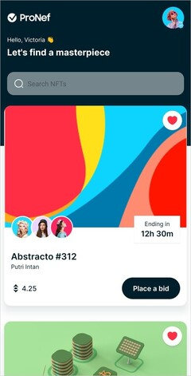
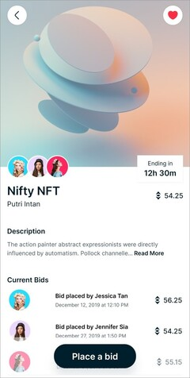

# NFT-Marketplace

Este proyecto es una aplicación móvil creada con React Native, JavaScript y Expo. La aplicación está orientada a los mercados de NFT y cuenta con una interfaz UI elegante para navegar por todos los NFT enumerados. Hay dos pantallas principales, la página de inicio donde se pueden ver todos los NFT y buscar a través de ellos, y una hermosa página de detalles de NFT donde se puede obtener más información sobre un NFT específico y ver todos sus activos. Para los estilos se utilizó `StyleSheet`.

## Tecnologías principales

-  React Native  
-  JavaScript  
-  Expo  

## Capturas de pantalla

Aquí se muestran las capturas de pantalla de la aplicación en dispositivos móviles:

## Créditos

Este proyecto fue creado a partir de un video tutorial de YouTube, "JavaScript Mastery". Puede encontrar el tutorial en el siguiente enlace: https://www.youtube.com/watch?v=_ivIUCSOZ78 

## Link

Puede escanear el siguiente código QR con la aplicación de Expo Go para interactuar con la aplicación.
